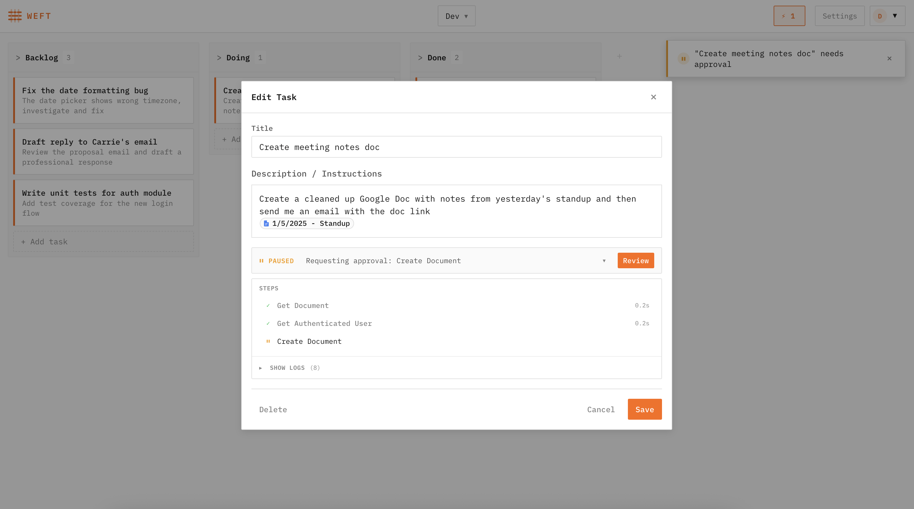

# Weft

Task management, but AI agents do your tasks.



## What is Weft?

Weft is a personal task board where AI agents work on your tasks. Create a task, assign it to an agent, and it gets to work. Agents can read your emails, draft responses, update spreadsheets, create PRs, and write code.

Run as many agents in parallel as you want. Get notified when tasks complete or need your approval. All actions that mutate state (sending emails, creating PRs, modifying documents) require your approval before committing.

**Built-in integrations:**
- Gmail (read, draft, send)
- Google Docs (create, edit)
- Google Sheets (create, update)
- GitHub (issues, PRs, code)
- [Cloudflare Sandbox](https://developers.cloudflare.com/sandbox/) (isolated containers for code execution and coding agents)
- [Remote MCP servers](https://modelcontextprotocol.io/) (bring your own tools)

**Self-hosted and private.** Deploy to your own Cloudflare account. Your data stays in your account.

## Architecture

Weft runs entirely on [Cloudflare's Developer Platform](https://workers.cloudflare.com/):

```
┌─────────────────────────────────────────────────────────────────────────┐
│                                                                         │
│   Browser ◄──────► Worker ◄──────► Durable Objects ◄──────► Workflows  │
│     │               (HTTP)          (BoardDO, UserDO)      (AgentWorkflow)
│     │                                     │                      │      │
│     │                                     │                      ▼      │
│     └─────── WebSocket ──────────────────►│              ┌────────────┐ │
│              (real-time updates)                         │  Anthropic │ │
│                                                          │  + Tools   │ │
│                                                          └────────────┘ │
└─────────────────────────────────────────────────────────────────────────┘
```

| Component | Purpose |
|-----------|---------|
| **[Workers](https://developers.cloudflare.com/workers/)** | HTTP routing, auth, serves React frontend |
| **[Durable Objects](https://developers.cloudflare.com/durable-objects/)** | Persistent state (boards, tasks, credentials) and real-time WebSocket updates |
| **[Workflows](https://developers.cloudflare.com/workflows/)** | Durable agent loop with automatic checkpointing and retry |

## Setup

### Prerequisites

- [Node.js](https://nodejs.org/) 18+
- [Cloudflare account](https://dash.cloudflare.com/sign-up) with [Workers Paid plan](https://developers.cloudflare.com/workers/platform/pricing/)
- OAuth credentials for integrations you want to use:
  - [Google](#google-gmail-docs-sheets) for Gmail/Docs/Sheets
  - [GitHub](#github) for GitHub

### 1. Clone and install

```bash
git clone https://github.com/jonesphillip/weft.git
cd weft
npm install
```

### 2. Configure environment

Copy the example environment file:

```bash
cp .env.example .env
```

Edit `.env` with your secrets:

```bash
# Encryption key for stored credentials (generate with: openssl rand -base64 32)
ENCRYPTION_KEY=your-generated-key

# OAuth credentials (add the ones you need)
GOOGLE_CLIENT_ID=...
GOOGLE_CLIENT_SECRET=...
GITHUB_CLIENT_ID=...
GITHUB_CLIENT_SECRET=...
```

See [Setting up OAuth credentials](#setting-up-oauth-credentials) for detailed instructions on creating Google and GitHub OAuth apps.

### 3. Run locally

```bash
npm run dev
```

This starts both the Vite dev server (frontend) and Wrangler (worker). Open http://localhost:5174.

By default, Weft runs without authentication. Boards and tasks are stored under the user defined by `USER_ID` in `wrangler.jsonc`.

### 4. Configure your board

After creating your first board, go to **Settings** and add your [Anthropic API key](https://console.anthropic.com/). This key is stored per-board and is required for agents to run.

### 5. Deploy to Cloudflare

Set your secrets (only set the ones you need):

| Secret | Required | Description |
|--------|----------|-------------|
| `ENCRYPTION_KEY` | Yes | Encrypts stored credentials. Generate with `openssl rand -base64 32` |
| `GOOGLE_CLIENT_ID` | For Google integrations | From [Google Cloud Console](#google-gmail-docs-sheets) |
| `GOOGLE_CLIENT_SECRET` | For Google integrations | From [Google Cloud Console](#google-gmail-docs-sheets) |
| `GITHUB_CLIENT_ID` | For GitHub integration | From [GitHub Developer Settings](#github) |
| `GITHUB_CLIENT_SECRET` | For GitHub integration | From [GitHub Developer Settings](#github) |

```bash
npx wrangler secret put ENCRYPTION_KEY --env production
npx wrangler secret put GOOGLE_CLIENT_ID --env production
npx wrangler secret put GOOGLE_CLIENT_SECRET --env production
npx wrangler secret put GITHUB_CLIENT_ID --env production
npx wrangler secret put GITHUB_CLIENT_SECRET --env production

npm run deploy:prod
```

### 6. Configure authentication

Authentication is controlled by the `AUTH_MODE` variable in `wrangler.jsonc`:

| AUTH_MODE | Description | Use case |
|-----------|-------------|----------|
| `none` | No authentication. Uses `USER_ID`/`USER_EMAIL` from config as singleton user. | Personal/single-user deployments |
| `access` | Cloudflare Access JWT verification. Requires `ACCESS_AUD`/`ACCESS_TEAM` secrets. | Multi-user or login-protected deployments |

By default, `AUTH_MODE` is set to `"none"` for both development and production.

#### Enabling Cloudflare Access authentication

For multi-user deployments or if you want login protection, enable [Cloudflare Access](https://developers.cloudflare.com/cloudflare-one/applications/configure-apps/):

1. In the Cloudflare dashboard, go to **Zero Trust > Access > Applications**
2. Create a new **Self-hosted application** with your Weft URL
3. Add an **Access policy** (e.g., allow only your email address)
4. After saving, find the **Application Audience (AUD) Tag** in the application settings
5. Your **team name** is in your Zero Trust dashboard URL: `https://<team>.cloudflareaccess.com`

Set the secrets:

```bash
npx wrangler secret put ACCESS_AUD --env production
npx wrangler secret put ACCESS_TEAM --env production
```

Then in `wrangler.jsonc`, change `AUTH_MODE` to `"access"` in the production environment:

```jsonc
"env": {
  "production": {
    "vars": {
      "AUTH_MODE": "access",
      // ...
    }
  }
}
```

## Project Structure

```
worker/
├── index.ts              # HTTP routing and auth
├── handlers/             # Request handlers
├── services/             # Business logic
├── workflows/            # Cloudflare Workflows (agent loop)
├── mcp/                  # MCP server registry
├── google/               # Google integrations (Gmail, Docs, Sheets)
└── github/               # GitHub integration

src/
├── components/           # React components
├── context/              # React context providers
├── hooks/                # Custom hooks
└── api/                  # API client
```

## Adding New Integrations

You can connect any [remote MCP server](https://modelcontextprotocol.io/) directly in your board settings without modifying code.

To add a built-in integration, Weft uses a registry-driven architecture:

1. Create your MCP server in `worker/` (see `worker/google/GmailMCP.ts` for example)
2. Register it in `worker/mcp/AccountMCPRegistry.ts`
3. Add OAuth handler if needed in `worker/handlers/oauth.ts`

The registry defines tool schemas, OAuth configuration, and workflow guidance—no changes needed to the agent workflow itself.

## Setting up OAuth credentials

### Google (Gmail, Docs, Sheets)

1. Go to the [Google Cloud Console](https://console.cloud.google.com/)
2. Create a new project or select an existing one
3. Go to **APIs & Services > Library** and enable the Gmail API, Google Docs API, and Google Sheets API
4. Go to **APIs & Services > OAuth consent screen** and configure it (External is fine, add yourself as a test user)
5. Go to **APIs & Services > Credentials**
6. Click **Create Credentials > OAuth client ID**
7. Select **Web application**
8. Add authorized JavaScript origins:
   - `http://localhost:5174` (development)
   - `https://weft.<your-subdomain>.workers.dev` (production)
9. Add authorized redirect URIs:
   - `http://localhost:5174/google/callback` (development)
   - `https://weft.<your-subdomain>.workers.dev/google/callback` (production)
10. Copy the Client ID and Client Secret to your `.env` file

### GitHub

1. Go to [GitHub Developer Settings](https://github.com/settings/developers)
2. Click **New OAuth App**
3. Set the homepage URL to your Weft deployment
4. Set the authorization callback URL:
   - `http://localhost:5174/github/callback` (development)
   - `https://weft.<your-subdomain>.workers.dev/github/callback` (production)
5. Copy the Client ID and Client Secret to your `.env` file

## License

Apache License 2.0 - see [LICENSE](LICENSE)
